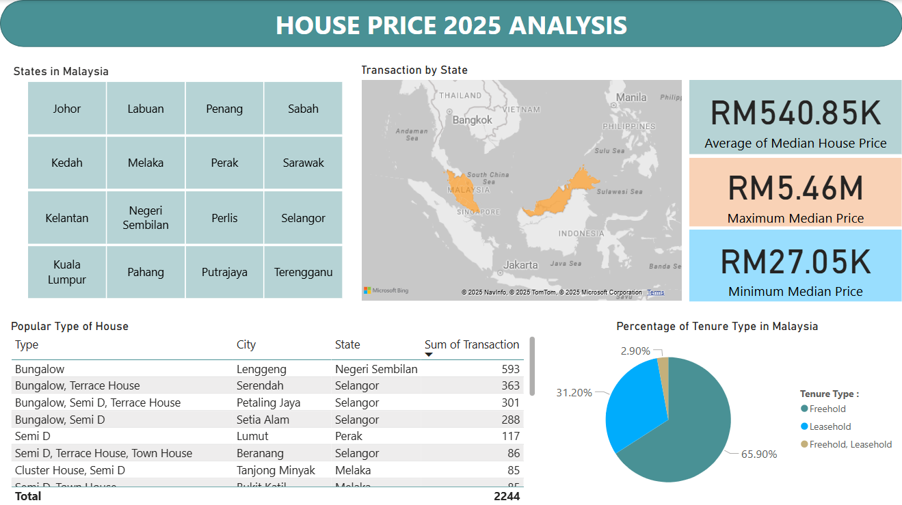

# House Price Analysis

## Project Overview
This project focuses on analyzing property market across states in Malaysia, using real-world data to simulate business-style reporting and geographical property insights. The purpose is to gain hands-on experience in data cleaning, SQL querying, and building interactive Power BI dashboards for data storytelling.

## Objectives
- Compare average median property prices by state in Malaysia.

- Identify overpriced and underpriced properties by state.

- Determine the most popular house type based on transaction volume.

- Analyze the percentage distribution of property tenure types.

## Data Source
- Dataset Name: House Prices in Malaysia (2025)
- Source: Kaggle
- Data Format: CSV
- Download Link: [*House Prices in Malaysia 2025 (Kaggle)*](https://www.kaggle.com/datasets/lyhatt/house-prices-in-malaysia-2025/data)

    | **Variable**     | **Description**                                                                 |
    |------------------|----------------------------------------------------------------------------------|
    | `Township`       | Name of the specific township where the house is located. |
    | `Area`           |  The district grouping multiple townships within a state. |
    | `State`          | The state in Malaysia where the house is located. |
    | `Tenure`         | Type of ownership (Freehold or Leasehold).                       |
    | `Type`           | Classification of the house.      |
    | `Median_Price`   | Median property price within the specified location.       |
    | `Median_PSF`     | The median price per square foot for the house.         |
    | `Transactions`   | Total number of recorded property transactions in the specified area or township.|

## Tools & Workflow
| **Step**                  |**Tool Used**        | **Description**                                                                 |
|-----------------------------|----------------------------------------|---------------------------------------------------------------------------------|
|Data Cleaning  | Microsoft Excel         | Cleaned and standardized the dataset and format columns consistently. |
|Data Analysis  | SQL             | Query the cleaned dataset to perform aggregations and comparisons. |
|Data Visualization | Power BI                | Created interactive dashboards to display key insights and comparisons.          |


## Data Cleaning (Microsoft Excel)

The original data is downloaded from Kaggle and required multiple cleaning steps before meaningful analysis could be performed.


- Convert the `Township` column to title case for consistent formatting.
- Add a unique ID column to serve as a row identifier.
- Format the `Median_Price` and `Median_PSF` columns with comma separators for better readability.
- Rename all column headers to lowercase for consistency.
- Standardize inconsistent entries in the `Type` column (e.g., “Bungalow, Semi D” vs. “Semi D, Bungalow”) using Excel functions such as IF, VLOOKUP, XLOOKUP, and TEXTJOIN. 

    *Before Cleaning:*
    
     

    *After Cleaning:*

    


The final cleaned dataset is displayed below and can be accessed here:
[*House Price Data Cleaned*](https://github.com/azerinnan/draft_house_price/blob/main/house_price_data_cleaned.xlsx)


## Data Analysis (SQL)

### `OBJECTIVE 1` : Compare the average median house price by state in Malaysia

```sql
-- Determine average median price by state
SELECT
    state,
    ROUND(AVG(median_price),2) AS avg_median_price
FROM houseprice
GROUP BY state
ORDER BY avg_median_price DESC;
```
Insights:

- Labuan shows the highest average median house price at RM 1.08 million, likely skewed due to having the only one township in the property market.
    
- Top 3 states with relatively high average median prices (excluding Labuan):
    -   Kelantan - RM 0.76 million
    -   Perlis - RM 0.62 million
    -   Sarawak - RM 0.53 million

- Most affordable states based on average median price are:
    -   Terengganu - RM 0.33 million 
    -   Putrajaya - RM 0.40 million

---
### `OBJECTIVE 2` : Identify states with the highest (overpriced) and lowest (underpriced) median house prices.

```sql
-- Determine overpriced states (highest median price per state)
WITH overprice AS (
	SELECT state, MAX(median_price) AS max_price
	FROM houseprice
	GROUP BY state
),

-- Determine underpriced states (lowest median price per state)
underprice AS (
	SELECT state, MIN(median_price) AS min_price
	FROM houseprice
	GROUP BY state
)

SELECT o.state, o.max_price, u.min_price
FROM overprice AS o
FULL JOIN underprice AS u
ON o.state = u.state
ORDER BY max_price DESC
```
Insights:
- Overpriced States (Highest Median Prices)
	- Kuala Lumpur - RM 5.46 million 
	- Johor - RM 4.05 million
	- Kedah - RM 3.71 million.
	
	The high demand for premium properties in Kuala Lumpur is due to its position as the central location of Malaysia's economic and commercial hub. Johor's location near Singapore and ongoing development projects in Kedah may also contribute to the rising house prices in these states.
- The lowest minimum median price id recorded in Selangor at RM 27,049 followed by Sarawak at RM 35,000. This could indicate the availability of low-cost housing units or auctioned properties within these states. It could also reflect lower demand or less-developed in certain part of these states.

---
### `OBJECTIVE 3` : Identify the most popular type of house based on transactions

```sql
-- Create a ranked list for each house type based on highest transaction counts
WITH ranktype AS (
		SELECT 
			type,
			township,
			area,
			state,
			transactions,
			ROW_NUMBER() OVER (PARTITION BY type
            ORDER BY transactions DESC) AS highest_transaction
		FROM houseprice
		)

-- Select the top location (city and state) for each house type based on the highest number of transactions
SELECT 
	type,
	township,
	area,
	state,
	transactions
FROM ranktype 
WHERE highest_transaction = 1
ORDER BY transactions DESC, type ASC;
```
Insights: 

- The **Bungalow** is the most popular type of house in the property market, with **593 transactions** in Bandar Tasik Senangin, Lenggeng, Negeri Sembilan.
- It is followed by **Bungalow & Terrace House** type with **363 transactions** in Bukit Sentosa, Serendah, Selangor.
- These areas are located outside major urban centers, offering a quieter and more spacious living environment. This may appeal to buyers looking for peaceful surroundings, larger land sizes, or more affordable detached housing options compared to properties in city centers.

---
### `OBJECTIVE 4` : Percentage of tenure
```SQL
-- Calculate the count and percentage distribution of selected tenure types
SELECT
	tenure, 
	COUNT(*) AS count_per_tenure,
	COUNT(*)*100.00/SUM(COUNT(*)) OVER () AS tenure_percentage
FROM houseprice
WHERE tenure IN ('Freehold','Leasehold','Freehold, Leasehold')
GROUP BY tenure
ORDER BY tenure_percentage DESC;
```

Insights: 
- The majority of properties (**65.90%**) are categorized as **Freehold**, making it the most common tenure type.
- Freehold properties grant buyers ownership of both the property and the land indefinitely. This tenure type is preferred by buyers seeking long-term investment stability and control over their property without concerns about lease expiration.
---

## Data Visualization (Power BI)
After completing data cleaning and analysis, Power BI is used to transform the processed data into an interactive dashboard that highlights median price comparisons by state, tenure types, housing type distributions, and transactions.

### Dashboard Preview



View the House Price 2025 Analysis here: [*House Price 2025 Analysis Dashboard*](https://github.com/azerinnan/draft_house_price/blob/main/6_houseprice_analysis_dashboard.pbix)


### Key Visuals and Features
- **Slicer - States in Malaysia**

	Filter all visual by state to compare house prices and transactions volumes.

- **Cards - Summary statistics**
	
	Displays the average, minimum and maximum median house price based on selected states.

- **Filled map - Transaction by states**
	
	Visualizes property market transactions by state across Malaysia.

- **Table – Popular house types**
	
	Displays each most popular house type along with its top location (city and state) and the number of transactions. Only the top location for each house type is shown.

- **Pie chart - Tenure type**

	Shows the percentage distribution of tenure types in Malaysia.

### Insights Highlighted
- Freehold is the dominant tenure type with 65.9% of the dataset.
- The average median house price in Malaysia is RM 540,850.
- Bungalows in Negeri Sembilan are the most transacted house type, with 593 transactions recorded.
- Kuala Lumpur and Johor have the highest median house prices in the Malaysian property market.